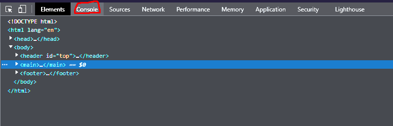

# Coding-Study-Guide
Course Work Study Guide
# <Your-Project-Title>

## Description

- My motivation to create this project was to learn some basics and fundamentals of HTML, Git, Javascript, and CSS by building a MVP which incorporated all four topics.
- Going on forward, I can update this website to increase functionality. 
- It will act as both an information storage for the bootcamp and a sandbox tool to try out new techniques.
-During this project, I learned fundamentals of HTML, such as how <meta> and <body> elements differ, fundamentals of css, such as how to link files and change element colors and structure, fundamentals of Git, such as the Git Workflow, and fundamentals of Javascript, such as <for> loops and arrays.

## Table of Contents

- [Installation](#installation)
- [Usage](#usage)
- [Credits](#credits)
- [License](#license)

## Installation

There are no steps to install my project due to its deployment. However, it does require a working internet browser with Javascript implementation. I recommend Chrome or Firefox on Windows or just Opera on MacOs.

## Usage

Visit the website through any means. Then, open the browser console (this differs from browser to browser), however you can usually right click anywhere on the page and click on "Inspect Element".

To add a screenshot, create an `assets/images` folder in your repository and upload your screenshot to it. Then, using the relative file path, add it to your README using the following syntax:

Next make sure you are on the console tab in the new window that opens up.

After that, you should be able to see the console and its recommendation for study. If you want to see another recommendation, refresh the page. This can usually be done at the top of your browser or by pressing the F5 key on your keyboard

## Credits

David Jover

UM Bootcamp provided most of the base code as well as the Bowtie Cat PNG.

Followed UM Coding Bootcamp Pre-Work Modules 1 through three to create this project.

## License

MIT License ![LICENSE]

---

🏆 The previous sections are the bare minimum, and your project will ultimately determine the content of this document. You might also want to consider adding the following sections.

## Badges

Badges aren't necessary, but they demonstrate street cred. Badges let other developers know that you know what you're doing. Check out the badges hosted by [shields.io](https://shields.io/). You may not understand what they all represent now, but you will in time.

## Features

Random Topic Suggestion

## How to Contribute

Talk to me directly or teach me how to code better. I will implement my learnings to this site.

## Tests

Not really any tests to run. Just reload the website to see the few console log variations. The instructions for this are stated under [Usage](#usage)